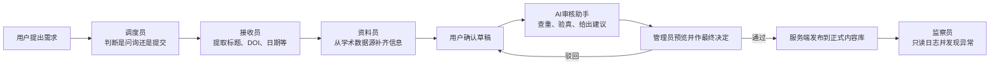
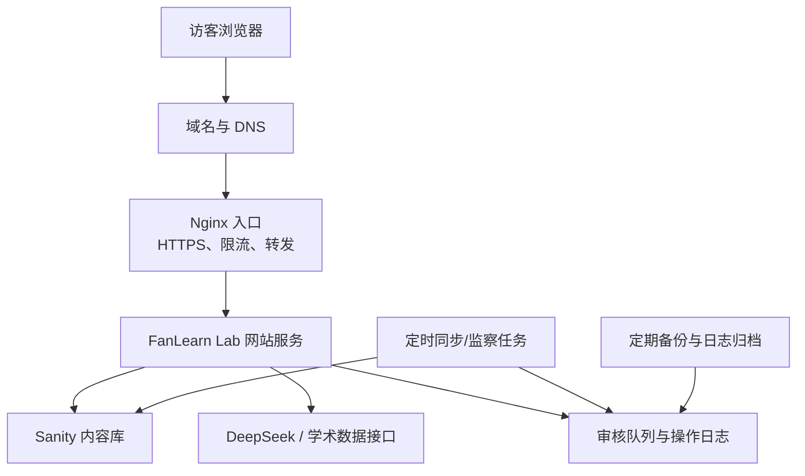

# FanLearn Lab 课题组网站开发情况汇报稿

> 汇报对象：课题组导师  
> 汇报口径：以产品价值、使用方式和建设计划为主，尽量避免过多技术术语  
> 项目当前阶段：Phase 1.6（成员管理、论文/动态详情、AI 动态起草和管理员审核原型已完成）

---

## 一、一分钟项目概述

FanLearn Lab 网站的定位，不只是一张“课题组网络名片”，而是一个集**对外展示、学术成果管理、成员协作和 AI 辅助**于一体的数字平台。

对外，它要清晰回答四个问题：“我们是谁”“我们研究什么”“我们做出了什么成果”“如何与我们建立联系”。

对内，它逐步解决“论文、成员资料和新闻需要反复找人改网页”的问题。目前已完成一套可操作原型：成员可维护本人资料、提交论文，或让 AI 起草动态；管理员预览、通过或驳回后再公开发布。正式上线时再将本地原型迁移到真实内容库与认证系统。

---

## 二、当前设计思路

### 1. 从“信息罗列”转向“对外叙事”

首页先用一段简短定性介绍说清课题组是谁，随后直接呈现“42+发表论文”等成果数据。团队、论文和动态统一为“单行精选预览 + 查看全部”，让访客先快速建立认知，再按需深入。

### 2. 同时服务多类人群

网站不只面向同行，也考虑潜在学生、合作者、学院管理者和课题组成员。不同人可以在同一网站中快速找到其最关心的信息。

### 3. 重视“可持续更新”

论文页已实现 DOI/标题查询、BibTeX 批量导入、本组作者校验和重复检查。论文与动态都先进入管理员消息中心，预览通过后再发布。

### 4. 学术感与科技感并存

全站采用简洁、留白充足的版式，使用靛蓝与青色作为品牌强调色，并同时支持深色和浅色主题。设计重点是“有识别度但不影响阅读”，已经去掉了纯装饰性粒子效果，保留网格、渐变光晕和适度动画。

---

## 三、网站功能结构图

```mermaid
flowchart TB
    A["FanLearn Lab 网站"]

    A --> B["对外展示"]
    A --> C["学术成果库"]
    A --> D["成员服务"]
    A --> E["AI 助手 LabMind"]
    A --> F["后台与运营能力"]

    B --> B1["首页：简介、成果数据、成员/论文/动态单行预览"]
    B --> B2["团队：指导老师/研究成员/毕业生"]
    B --> B3["成员主页：简介、方向、论文、动态、学术链接"]
    B --> B4["动态：论文发表、学术动态、成员动态"]

    C --> C1["搜索：标题、作者、会议、关键词"]
    C --> C2["筛选：年份、论文类型"]
    C --> C3["阅读：摘要、PDF、代码、项目链接"]
    C --> C4["引用：一键复制 BibTeX"]

    D --> D1["成员登录"]
    D --> D2["DOI/标题自动补全"]
    D --> D3["BibTeX 批量导入"]
    D --> D4["个人主页快速入口"]
    D --> D5["成员自助编辑与管理员成员管理"]

    E --> E1["访客问答：了解课题组"]
    E --> E2["动态起草：DeepSeek 生成/修订 + 人工编辑 + 预览"]
    E --> E3["信息补全与确认"]

    F --> F1["服务端认证、数据与可视化后台（下一阶段）"]
    F --> F2["管理员消息与审核队列（已有本地原型）"]
    F --> F3["自动同步与监测（后续阶段）"]
```

这张图可以概括为两层：上层是访客能看到和使用的页面，下层是让内容持续更新、可以审核和回溯的运营能力。

---

## 四、各版面与使用方式

| 版面 | 用户能看到什么 | 如何使用 | 产生的价值 |
|---|---|---|---|
| **首页** | 简短定性介绍、42+ 等成果数据，以及成员/论文/动态单行预览 | 直接点击预览项或“查看全部”进入完整版面 | 在最短时间内建立课题组品牌印象 |
| **团队** | 指导老师、研究成员和毕业生 | 切换三类成员；成员编辑本人资料；管理员新增、编辑或删除成员 | 同时展示队伍与承担可持续成员管理 |
| **成员主页** | 个人简介、研究方向、联系方式、Scholar/GitHub/个人网站链接、发表论文和科研动态 | 通过两个标签切换“发表文章/科研动态” | 形成成员的可持续学术档案，方便招生与合作了解 |
| **学术成果** | 全部论文、详情页、摘要、引用和外部链接 | 搜索/筛选，展开摘要，复制 BibTeX；成员提交时自动校验本组作者和重复项 | 把分散成果变为可检索、可引用、可审核的学术资产 |
| **课题组动态** | 统一分为论文发表、学术动态、成员动态三类，并提供详情页 | 成员可选类型、添加参考链接或文本文件，让 DeepSeek 起草，人工编辑或继续修订，预览后提交审核 | 分类更易理解，也便于长期形成统一、规范、可回溯的传播素材 |
| **AI 助手** | DeepSeek 对话界面、建议问题与文本文件上传 | 访客可询问课题组信息，也可上传受限文本文件作为对话参考；提交仍需进入对应业务页面 | 降低信息查找门槛，同时避免 AI 越过人工确认直接发布 |
| **管理员消息** | 待审论文、动态和历史审核记录 | 管理员预览完整内容，通过并发布，或填写理由后驳回 | 把提交与对外发布分开，保证内容质量 |
| **登录与主题** | 成员登录入口、当前身份、深/浅色切换 | 成员登录后可看到论文添加和 BibTeX 导入功能；主题选择会保留 | 为后续内外权限和真实内容管理打基础 |

### 目前的论文新增流程

1. 成员登录后进入“学术成果”页。
2. 选择“添加论文”，输入 DOI 或论文标题。
3. 系统从 Semantic Scholar 查询候选论文，自动带出标题、作者、年份、来源和摘要。
4. 系统检查作者中是否包含本组成员，并按 DOI/标题查重。
5. 提交后进入管理员消息中心；通过后发布，并同步到所有相关成员主页。

**说明：**上述审核流程已可演示，但数据仍保存在当前浏览器中。正式上线后需迁移至共享数据库和服务端权限系统。

---

## 五、用户分类与权限

| 用户 | 主要需求 | 当前可用能力 | 未来权限 |
|---|---|---|---|
| **访客** | 了解课题组、成员、研究方向和成果 | 浏览全部公开页面，搜索与筛选内容，使用 AI 问答 | 始终保持只读，不能修改公开内容 |
| **课题组成员** | 维护本人信息、论文和动态 | 编辑本人基础资料；管理账号手机号/密码；提交论文；用 DeepSeek 起草、编辑、预览并提交动态 | 正式上线后使用真实账号与共享数据库 |
| **附加管理员权限的成员** | 维持站点内容完整、准确和及时 | 新增/编辑/删除成员，建立新成员初始账户，预览并审核论文和动态 | 后续增加服务端权限、审核通知和审计日志 |

成员档案只按“指导老师、研究成员、毕业生”分类；“管理员”是可附加在任一成员账户上的管理权限，不再与学术身份混在一起。

---

## 六、开发技术方案（非技术表述）

可以把整个网站理解为“前台展厅 + 后台编辑部 + AI 助理 + 运行基础设施”。

### 1. 前台展厅

前台负责所有访客直接看到的页面。项目使用 Next.js 搭建，但对日常运营而言，可以简单理解为：一套同时适配电脑和手机、能快速打开、方便继续扩展的网站骨架。

### 2. 后台编辑部

当前数据是用模拟内容运行的，便于先确认页面和流程。下一阶段首先把账号、权限、审核记录和内容数据迁移到服务器，再接入 Sanity 等可视化内容管理能力。届时，更新成员简介、新增论文或发布动态，将像填在线表单一样完成，不需要直接修改网站代码。

### 3. 前后台如何更新

- **改页面、功能或视觉**：由开发端修改并测试，通过版本管理发布；每次发布都可保留记录，出现问题可回退。
- **改成员、论文或新闻内容**：未来由管理员或成员在后台填写，前台自动读取并更新，不必为了改一条新闻重新开发。
- **批量学术数据**：由 DOI、BibTeX 和后续的定时同步服务协助，人员只做确认和例外处理。

### 4. 为什么不直接做成纯静态网页

纯静态网页建设快，但后续每次新增论文、调整成员或发布新闻都需要找开发人员修改文件。FanLearn Lab 选择了可逐步演进的方案：先快速建立可用的前台，再接入内容后台、审核和自动同步，避免一开始就进行高成本的完整系统建设。

---

## 七、Agent 的设计逻辑：Harness Engineering

### 1. 核心思路

Harness Engineering 可以理解为“给 AI 配上明确岗位、操作权限和工作记录”。

我们不让一个 AI 既查资料、又审核、还能直接删改网站，而是把整个过程设计成一个编辑部流程：

### 2. 几个关键约束

- **职责分离**：负责搜索资料的 Agent 没有发布权限。
- **唯一写入口**：AI 不直接发布，只有管理员在服务端确认后，内容才能进入正式内容库。
- **工具白名单**：每个 Agent 只能使用与岗位相关的几项工具。
- **运行额度**：限制每次处理的文字、附件、步骤、重试和等待时间，避免失控与费用浪费。
- **人工确认**：不确定、信息冲突或涉及敏感内容时，不自动发布，转人工处理。
- **全程留痕但不抄录隐私**：记录调用规模、结果、耗时和审核决定，不把用户原文、附件正文或密码写入技术日志。
- **监察者只读**：监察 Agent 只能发出告警，不能擅自修改或删除内容。

### 3. 对导师的实际价值

这一设计不是为了显示 AI 技术复杂度，而是为了解决三个运营问题：

1. 让论文和动态的录入更省时。
2. 避免 AI 查到错误信息后直接对外发布。
3. 将导师从日常录入中解放出来，只处理有争议或需要定标准的事项。

### 4. 当前完成度

目前 AI 对话、Intake 和动态生成已统一使用 DeepSeek，并已为 AI 增加工具白名单、输入与附件上限、超时、去敏记录以及“不得直接发布”的边界。网站也已有可操作的人工审核队列：管理员可预览、通过或驳回论文和动态。但当前队列仍是浏览器本地原型，服务端认证、正式数据库、完整审计日志和 Watchdog（监察）尚属后续建设内容。

---

## 八、阿里云服务器部署方案

### 1. 整体思路

在页面和交互稳定后，可先用轻量方式进行对外演示；当内容管理、审核、定时同步等长期运行需求成熟后，再迁移到阿里云 ECS。

一台初始服务器可以先承担以下角色：

### 2. 建议的实施步骤

1. **确定主体和域名**：优先确认是使用学校/学院的二级域名，还是课题组独立域名。
2. **购买 ECS**：初期可从 2 核 4GB 量级起步，实际选择根据并发访问、数据库是否同机部署及年度价格再确定。
3. **容器化打包**：把网站、定时任务、监察服务和数据库分成独立服务，用 Docker Compose 统一启动和升级。
4. **设置 Nginx 入口**：统一处理网页访问、HTTPS 证书、AI 接口限流和访问日志。
5. **配置域名、证书与备案**：如服务器位于中国内地，正式开站前需完成 ICP 备案，开站后还需按规定完成公安联网备案；同时部署 HTTPS 证书。
6. **配置安全组**：公网只放行 Web 需要的 80/443 端口；SSH 管理端口只允许固定管理 IP；数据库端口不对公网开放。
7. **建立发布与回退流程**：新版本先通过检查，再替换线上容器；保留上一个可用版本，出现问题时能快速回退。
8. **建立备份和监测**：数据库每日备份，定期异机保存；监测网站是否可访问、证书是否即将过期、AI 费用和接口异常。

根据阿里云官方文档，安全组相当于云上防火墙，公网建站可放行 80/443，SSH 不建议长期对所有 IP 开放，数据库端口不应对公网开放。阿里云也提供将 SSL 证书部署到 Nginx 以开启 HTTPS 的官方流程。

### 3. 两个部署选择

| 方案 | 优点 | 需要承担的责任 | 适用时机 |
|---|---|---|---|
| **先云托管，后迁阿里云** | 早期上线快，运维压力小 | 后期需要做一次迁移 | 页面验收、小范围试用 |
| **直接阿里云 ECS** | 数据和运行环境自主，便于长期运行爬虫和 Agent | 需要自行负责安全、更新、备份和监测 | 正式运营、后台和定时任务上线后 |

结合当前进度，建议先完成内容真实化和核心流程验收，再进行阿里云正式迁移，避免在产品尚未定型时同时承担大量服务器运维工作。

---

## 九、开发进度与后续计划

| 阶段 | 核心目标 | 当前状态 | 产出/验收标准 |
|---|---|---|---|
| **Phase 1：基础站点** | 建立首页、团队、论文、动态和 AI 对话骨架 | **已完成** | 主要页面可访问，桌面端和移动端基本可用 |
| **Phase 1.5：体验与论文工具** | 统一视觉、加入深/浅主题、登录、DOI 查询、BibTeX 导入、成员-论文自动关联 | **主体已完成** | 用户能搜索、筛选、导入、切换主题，成员论文可自动归类 |
| **Phase 1.6：管理与审核原型** | 成员分类/自助编辑、管理员成员管理、内容详情、三类动态、DeepSeek 起草、审核消息中心和 AI 权限边界 | **已完成可操作原型** | 论文/动态可提交、预览、审核、发布；规范、类型和生产构建检查均通过 |
| **Phase 2：服务端可信基础** | 真实登录与权限、数据库审核记录、文件存储，并确定 Sanity/数据库的唯一内容来源 | **待开始** | 账号权限不可由浏览器篡改；管理员不改代码即可管理内容；操作可追溯 |
| **Phase 3：AI 智能化** | 让 AI 基于真实课题组资料问答，连通论文自动补全与确认 | **部分骨架已有** | 回答可追溯至正式数据；提交前必须给用户确认 |
| **Phase 4：智能审核与监察** | Moderation Agent 审核建议、完整日志与 Watchdog | **已设计，待实现** | AI 不直接发布；管理员决定可回溯；异常内容进入人工处理 |
| **Phase 5：定时同步** | 自动发现新论文，更新引用数等学术信息 | **规划中** | 定时任务可监测、失败可重试，新内容仍先审核再发布 |
| **Phase 6：正式上云** | 迁移阿里云 ECS，绑定域名、HTTPS、备份与监测 | **规划中** | 稳定对外访问，可发布、可回退、可告警、可恢复 |

### 建议的近期优先级

1. **先做内容真实化**：由导师/课题组确认正式成员、个人简介、论文、项目和联系方式。
2. **再做内容后台**：使网站的更新不再依赖开发人员。
3. **再打通 AI 与审核**：先确保数据源真实、权限和审核机制明确，再扩大自动化。
4. **最后进行正式上云和定时同步**：将稳定的产品迁移到长期运行环境。

---

## 十、网站后续运营方法

### 1. 建立最小运营分工

- **导师**：确定对外口径、研究方向和重要内容发布标准。
- **内容管理员**：建议由 1 名固定成员担任，每月汇总论文发表、学术动态和成员动态。
- **成员**：提交本人论文、简介和动态草稿，对个人信息准确性负责。
- **技术维护者**：负责功能升级、服务器、备份、安全更新和故障处理。

### 2. 建立内容更新节奏

- 论文发表、重要学术活动或成员变化：建议在 3–7 天内更新。
- 成员资料：每学期开始集中核对一次。
- 论文和引用信息：每月或每季度检查，后续交由定时同步。
- 网站功能和链接：每季度做一次巡检。

### 3. 用产品指标判断网站是否有效

不必一开始就追求复杂数据，可以先观察四类简单指标：

- 网站内容是否在持续更新，有无超过一学期未更新的页面。
- 用户最常访问的是团队、论文还是招生/联系信息。
- 通过网站而来的合作、学生咨询或媒体联系有多少。
- 成员新增一篇论文或一条动态平均需要多长时间。

---

## 十一、建议汇报时现场演示的顺序

1. **首页（30 秒）**：讲清课题组定位、研究方向和导航逻辑，演示深/浅主题。
2. **团队与成员主页（1–2 分钟）**：切换指导老师/研究成员/毕业生，演示成员编辑本人资料和管理员的成员管理。
3. **论文页（1–2 分钟）**：搜索、筛选、展开摘要、复制 BibTeX；演示 DOI/标题自动补全、作者校验、查重和详情页。
4. **动态页（1–2 分钟）**：演示用自然语言向 DeepSeek 说明要求，生成后人工编辑、让 AI 修订和发布前预览。
5. **管理员审核（1 分钟）**：打开消息按钮，预览待审内容，通过后演示它如何出现在公开页面和相关成员主页。
6. **收尾（30 秒）**：强调当前已完成前台和核心流程验证，下一步是真实内容、内容后台和权限/审核，而不是继续增加视觉效果。

---

## 十二、希望导师确认的决策项

1. **网站对外主叙事**：“人工智能与教育”是否作为总方向，首页优先展示哪三个子方向。
2. **正式内容范围**：成员、已毕业成员、论文、项目、获奖和招生信息哪些对外公开。
3. **网站名称与域名**：FanLearn Lab / 泛学习实验室是否作为正式名称，是否可申请学校或学院二级域名。
4. **内容管理人**：确定 1 名固定管理员，负责日常内容审核和更新。
5. **AI 的权限边界**：短期内是否仅用于问答和资料补全，不允许无人确认的自动发布。
6. **部署主体**：未来阿里云账号、域名、备案与服务器费用由课题组、学院还是其他主体承担。

---

## 十三、汇报用收尾话术

目前项目已经完成了从“概念”到“可演示产品”的转变：课题组对外展示所需的主要页面已经齐备，论文查询、搜索、筛选、BibTeX 导入和成员论文自动关联等核心体验也已完成。

下一阶段的重点不是再做更多装饰，而是完成三件事：**第一，将展示数据替换为经课题组确认的真实内容；第二，先把真实账户、管理权限和审核记录迁移到服务器，再上线不依赖代码的内容管理后台；第三，将已验证的 AI 起草与管理员审核流程迁移到服务器，形成真正可回溯的长期运营机制。**

网站的最终目标，是成为课题组可长期积累、可持续运营的数字资产，而不是一次性项目。

---

## 附录 A：汇报前内部校准清单（不建议直接放入汇报展示页）

1. 当前成员学位、毕业年份和个人简介仍应由课题组按正式名单做一次最终核验。
2. AI 系统已统一迁移至 DeepSeek，正式演示前需在 `.env.local` 填写 `DEEPSEEK_API_KEY`。
3. 当前多篇论文、DOI、头像和外部链接为演示数据或占位内容，不宜直接公开发布。
4. 当前登录是浏览器本地的模拟认证，只适用于界面验证，不适合作为正式安全机制。
5. TypeScript 类型检查、ESLint 规范检查和 Next.js 生产构建均已通过。
6. 当前项目目录未检测到 Git 版本库，正式进入多人协作和自动发布前，需确认代码仓库与备份策略。
7. 依赖安全检查未发现高危或严重漏洞，但旧版 AI SDK 和 Next 内置组件仍有低/中等级公告；进入服务端阶段时需安排一次有回归测试的依赖升级，不建议直接强制升级。

---

## 附录 B：阿里云部署依据

- [阿里云：使用安全组](https://help.aliyun.com/zh/ecs/user-guide/start-using-security-groups)
- [阿里云：为 Web 服务器开启 HTTPS](https://help.aliyun.com/zh/ecs/user-guide/ssl)
- [阿里云：网站备案流程](https://help.aliyun.com/zh/dws/icp-filing)
